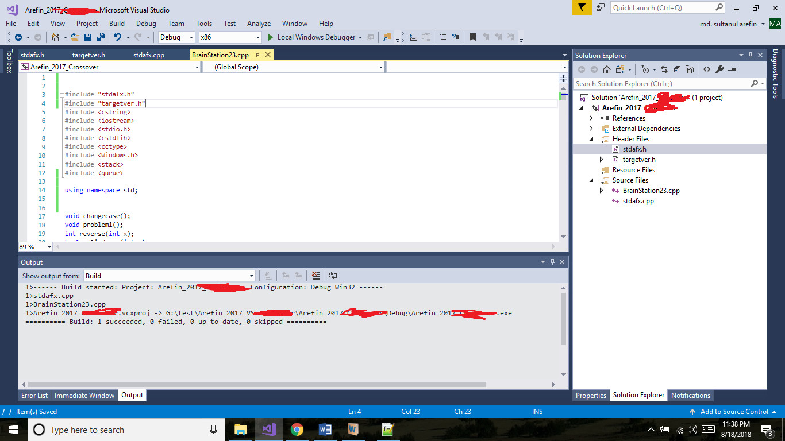

# CPPworks

### I used to programm C/C++ in Visual studio, instead of Codeblocks, Dev C++ or Turbo C++.
	
###	If you found the header // stdafx.h  you can remove this header if you are coding in Codeblocks or Dev C++.

	
### As far i can remember:
	
** stdafx.h is a header file in c++ boilerplate project provided by visual studio.**
	
** I put here codes/ instructions to include other header files and suppress warning commands etc.**
	
### Here is a typical stdafx.h file:
	
	// stdafx.h : include file for standard system include files,
	// or project specific include files that are used frequently, but
	// are changed infrequently
	
	#pragma once

	#define _CRT_SECURE_NO_WARNINGS

	#include "targetver.h"
	#include <tchar.h>

	// TODO: reference additional headers your program requires here
	
	
	
	
#### If you encounter codes like scanf_s("%d", &a); which is nothing but another implementation of scanf.
	
#### you can change it, if your compiler shows no comile time error (usually this is the case for editors other than Visual Studio)
	
#### Search Stack overflow and MSDN Documnetation please.
#### For example: https://msdn.microsoft.com/en-us/library/zkx076cy.aspx

Thanks!

-Md. Sultanul Arefin

[Twitter](https://twitter.com/mdsultanul)
 

[LinkedIn](https://linkedin.com/in/mdarefin28/)

	
	
	
	
	

